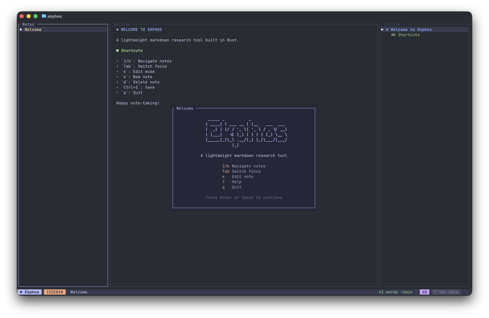

# Ekphos

[](https://crates.io/crates/ekphos)
[](https://www.rust-lang.org/)
[](https://github.com/hanebox/ekphos/blob/main/LICENSE)

An open source, lightweight, fast, terminal-based markdown research tool built with Rust.



## Documentation

**Full documentation has moved to [docs.ekphos.xyz](https://docs.ekphos.xyz)**

## Quick Start

```bash
cargo install ekphos
```

> **Note:** Always update to the latest version. If you encounter config issues after updating, run `ekphos --reset` to reset your configuration.

## Requirements

- Rust 1.70+
- For inline images: iTerm2, Kitty, WezTerm, Ghostty, or Sixel-compatible terminal

## Contributing

```bash
git clone https://github.com/hanebox/ekphos.git
cd ekphos
make run
```

1. Fork the repository
2. Create a feature branch from `main`
3. Make your changes
4. Submit a PR to the `main` branch

To contribute to the documentation, see [ekphos-docs](https://github.com/hanebox/ekphos-docs).

## Disclaimer

This project is in early development. There may be breaking changes and bugs in pre-releases.

## License

MIT
